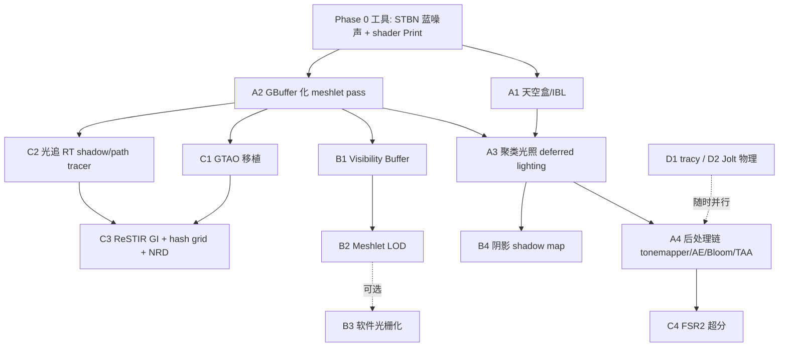

# Vultana 对齐 RealEngine 路线图

日期：2026-08-03
状态：路线图存档（暂不实施）

## 背景

Vultana 已完成 GPU-driven meshlet 两阶段遮挡剔除（对应 RealEngine 的 core pipeline）。本文档对比参考引擎 [RealEngine](D:/Program/CG/RealEngine)（DX12 Ultimate toy engine）的能力清单，列出 Vultana 的差距、路线图与推荐顺序。

## Vultana 现状

- Render graph（DAG + 资源别名 + barrier）
- GPU-driven meshlet 两阶段剔除（HZB 三链：1st/2nd phase culling + scene）
- bindless（VK_EXT_descriptor_buffer，SM6.6）
- compute skinning（骨骼动画）
- ImGui 编辑器 + ObjectID picking + gizmo
- GPUDrivenStats / GPUDrivenDebugLine
- meshlet pass 直接输出颜色（forward 风格，无 GBuffer、无 lighting pass）

## RealEngine 已有功能（README 勾选 + 源码确认）

render graph（含 async compute）、GTAO、specular GI、diffuse GI、clustered shading、Bloom、Auto Exposure、TAA、CAS、meshlet 两阶段剔除、RTX、参考 path tracer、FSR2/DLSS/XeSS、DOF、motion blur、光追阴影、ReSTIR DI/GI、hash grid radiance cache、混合随机反射、NRD + OIDN 降噪、shader 内 `Print`/`DrawLine`、STBN 蓝噪声、tracy、Jolt 物理、D3D12/Vulkan/Metal/mock 四后端 gfx。

关键结构事实：RealEngine 的 meshlet base pass 直接输出 GBuffer（diffuse/specular/normal/emissive/custom 5 张 RT + depth），走 GPU-driven 延迟路径。

## 差距与路线图

| 阶段 | 内容 | 前置 | 工作量 | 对齐度 |
|---|---|---|---|---|
| **P0** | STBN 蓝噪声、shader 内 Print 调试 | 无 | 小 | RE 有（stbn.cpp / debug_print.hlsl） |
| **A1** | 天空盒 + IBL（cubemap 加载、sky pass、环境光） | 无 | 小 | RE 有（sky_cubemap.cpp） |
| **A2** | meshlet pass 改输出 GBuffer（5 RT + depth + velocity） | P0 | 中 | RE 核心路径，结构性决策 |
| **A3** | 光源数据上传 + clustered light culling + deferred PBR lighting | A2 | 中 | RE 有（clustered_light_lists） |
| **A4** | ACES tonemapper → Auto Exposure → Bloom → TAA → CAS | A3 | 中 | RE 全套 |
| **B1** | Visibility Buffer（triangleID/instanceID → 材质 pass） | A2 | 中-大 | RE 未做（planned），Vultana 可领先 |
| **B2** | Meshlet LOD（meshopt_simplify 多级 cluster + 距离选择） | B1 | 大 | RE 未做，Nanite 核心 |
| **B3** | 软件光栅化小三角形 | B2 | 很大 | 可选 |
| **B4** | Shadow map（用 LOD meshlet 渲 depth） | A3/B2 | 中 | RE 用光追阴影替代 |
| **C1** | GTAO（XeGTAO 开源 HLSL 移植） | A2 | 中 | RE 有 |
| **C2** | VK_KHR_ray_tracing：TLAS/BLAS → RT shadow → path tracer | A2 | 大 | RE 有 RTX + path tracer |
| **C3** | ReSTIR GI / hash grid radiance cache + NRD 降噪 | C1+C2 | 很大 | RE 亮点区 |
| **C4** | FSR2（Vulkan 版；DLSS 是 DX12 专属） | A4 | 中 | RE 三超分 |
| **D1/D2** | tracy 剖析、Jolt 物理 | 无 | 小 | RE 有 |

## 推荐顺序

1. **A2 是第一优先**：数据通路岔路口，A2+A3 完成即从"无光照"跳到"PBR 延迟光照"，C 阶段全部依赖其 GBuffer。RealEngine base_pass 已验证此路径。
2. A1 天空盒独立小项，可与 A2 并行（画面立刻不黑）。
3. A4 紧随 A3：tonemapper 立刻需要，TAA 依赖 A2 预留的 velocity。
4. **B 阶段是 Vultana 相对 RealEngine 的差异化战场**（VB/LOD 均为 RE 未做项）。
5. C 阶段是 RE 技术亮点，全部长在 A2 的 GBuffer 上。

## 技术栈注意

- DLSS 为 DX12 专属；Vulkan 用 FSR2/XeSS 平替。
- NRD 有 Vulkan 版；OIDN 为 CPU 降噪，可作备份。
- 多后端（RE 的 gfx 四后端抽象）不建议 Vultana 追赶。
- TAA 需要 meshlet pass 输出 motion vector（A2 时一并加 velocity RT）。
